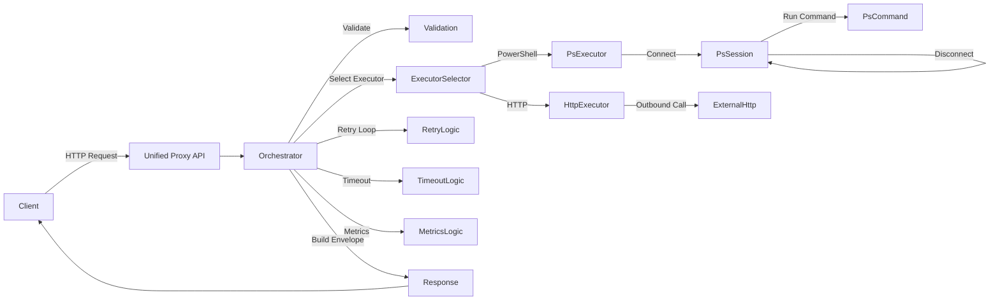
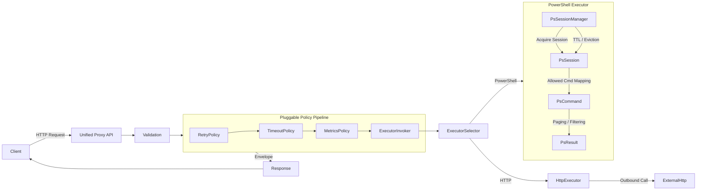

# Remote Request Execution Service

A production-grade, extensible remote request execution service in **.NET 8**, supporting **HTTP** and **PowerShell** execution with **custom resilience**, **metrics**, **structured responses**, **secure logging**, and full test coverage.

## ⚙️ Architecture Overview

Delivered previously



Last delivery covering the previous GAPs



## Features

### 1. Unified Proxy API

Catch‑all execution surface:

```
POST /api/{executorType}/{**path}
```

### 2. Executors

#### HTTP Executor

- Forwards outbound HTTP with method, headers, query, and body.
- Returns status, headers, truncated body.

#### PowerShell Executor

- Creates isolated session per request.
- Enforces allowlist.
- Returns objects / stdout / stderr.

### 3. Validation Layer

Rejects malformed requests with structured safe errors.

### 4. Structured Response Envelope

Contains:

- requestId
- correlationId
- executorType
- timestamps
- status
- attempt summaries
- result payload

Adds headers:

- X-Request-ID
- X-Correlation-ID
- X-Attempt-Count
- X-Instance-ID

### 5. Observability

- Structured logs
- Metrics at `GET /api/metrics`

### 6. Security

- PowerShell allowlist
- Sensitive logging sanitized

### 7. Containerization

Multi-stage Dockerfile included.

## Run Locally

### Dotnet

```
dotnet run --project src/RemoteExec.Api
```

### Docker

```
docker build -t remote-exec .
docker run -p 8080:8080 remote-exec
```

## Example Calls

### HTTP

```
curl -X POST http://localhost:8080/api/http/test  -H "Content-Type: application/json"  -d '{ "url": "https://example.com", "method": "GET" }'
```

### PowerShell

```
curl -X POST http://localhost:8080/api/powershell/run  -d '{ "command": "Get-Date" }'
```

## If I Had More Time

- Clean up RequestOrchestrator responsibilities
- Align more closely with EXO semantics (Powershell)
- Consider an IClock abstraction
- Make validation errors structured & explicit
- Implement transient vs non-transient classification
- Add “requests_retried” metric
- Make attempt summaries more structured
- Rate limiting
- Pluggable policy chain
- Multi-executor circuit breakers
