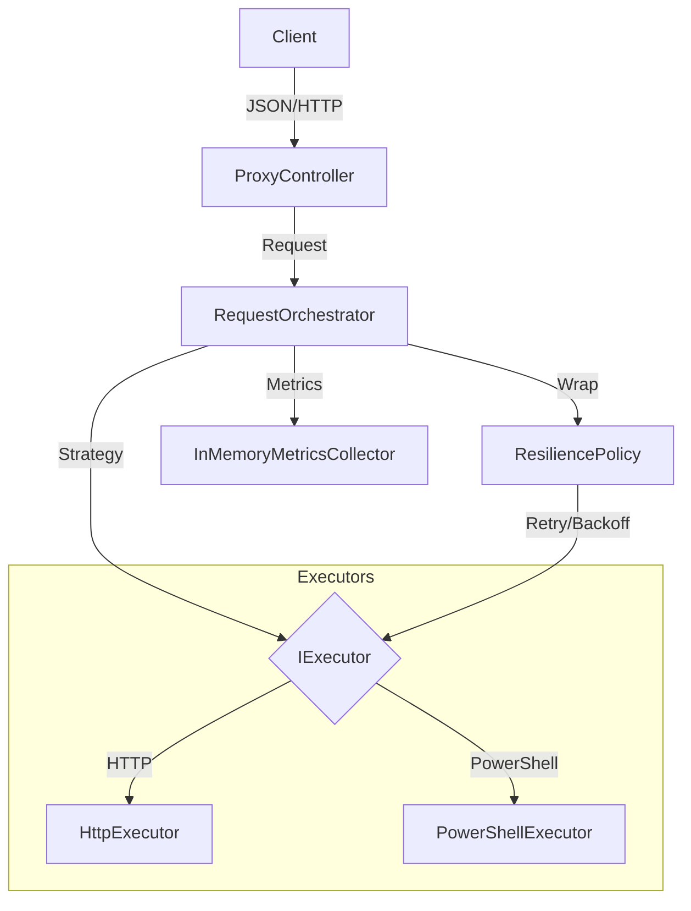

# Remote Request Execution Service

A production-grade, extensible service in C# for executing remote requests via HTTP and PowerShell.

## Architecture

The solution follows a **Modular Monolith** approach using generic .NET Core abstractions.



### Design Decisions

1.  **Unified API**: The service exposes a single catch-all route `/api/{**path}`. The request `Body` contains the execution details (URL/Command), while the `Path` is preserved as metadata. This allows the service to act as a smart proxy.
2.  **Custom Resilience Engine**: Instead of using Polly (which is excellent but standard), I implemented a custom `ResiliencePolicy` to demonstrate understanding of retry algorithms (Exponential Backoff + Jitter).
    - **Backoff Math**: `Delay = min(MaxDelay, BaseDelay * 2^(Attempt-1))` with +/- Jitter.
    - **Justification**: Exponential backoff prevents thundering herds. Jitter prevents synchronized retries from multiple clients.
3.  **No Database**: State (Metrics) is kept in-memory using `ConcurrentDictionary` and `Interlocked` operations for thread safety and high performance without external dependencies.
4.  **PowerShell Security**: An Allowlist Strategy is strictly enforced. Only pre-defined commands (`Get-Process`, etc.) are allowed. Runspaces are isolated per request interpretation (though in this generic implementation they are transient).

## Resilience Strategy

- **Transient Failures**: Network timeouts, 5xx errors (conceptually - current implementation retries generic Exceptions).
- **Backoff**:
  - Base Delay: 500ms
  - Max Delay: 5000ms
  - Factor: 2.0 (Exponential)
  - Jitter: +/- 20%
- **Timeout**:
  - Per-attempt timeout (default 10s) using `CancellationTokenSource.CreateLinkedTokenSource`.

## Running Locally

### Prerequisites

- .NET 8 SDK
- Docker

### Run with Dotnet

```bash
dotnet run --project src/RemoteExec.Api
```

### Run with Docker

```bash
docker build -t remote-executor .
docker run -p 8080:8080 remote-executor
```

### Sample Request

## HTTP request

```bash
curl -X POST http://localhost:8080/api/http \
   -H "Content-Type: application/json" \
   -d '{ "url": "https://httpbin.org/get", "method": "GET" }'
```

## Powershell request

```bash
curl --location 'http://localhost:8080/api/powershell' \
    -H 'Content-Type: text/plain' \
    -d '{ "command": "Get-Date", "args": { "Format": "yyyy-MM-dd" } }'
```

## Security & Limitations

- **Secrets**: Log scrubbing is implemented via `LogSanitizer`, masking `Authorization` headers and `password` JSON fields.
- **Input Limits**: Max request body size is limited to 10MB (configurable) to prevent DoS.
- **PowerShell**:
  - Supports local isolated Runspaces.
  - Supports Remote Sessions via WSMan (requires valid target).
  - Strict Allowlist for commands.

## "If I had more time..."

- Add Authentication (JWT) to the Proxy.
